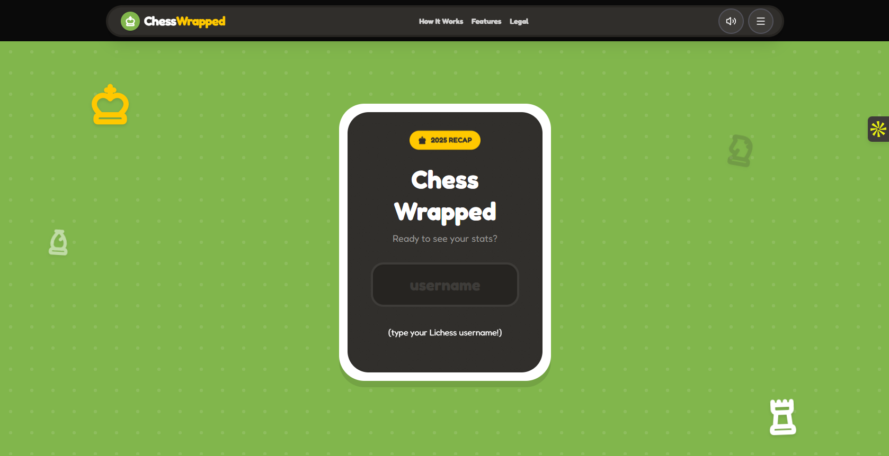
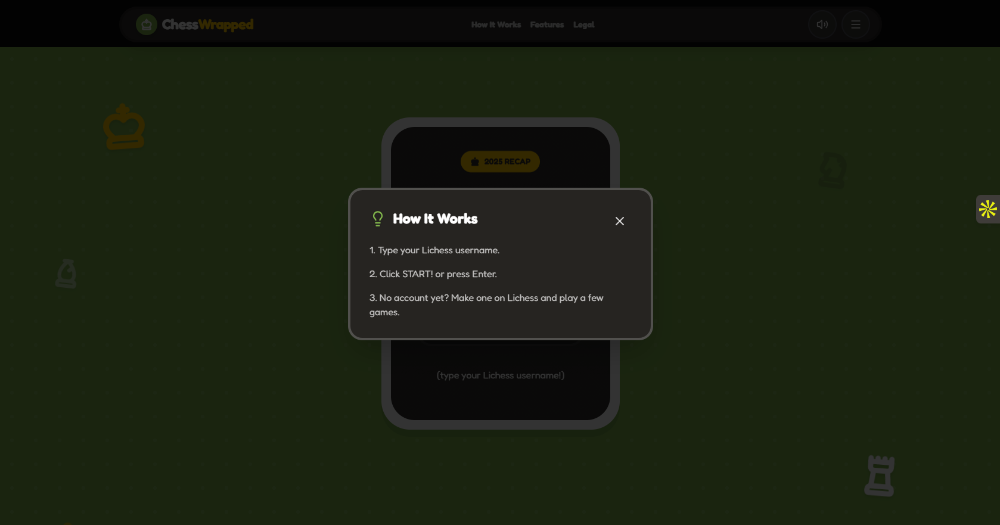
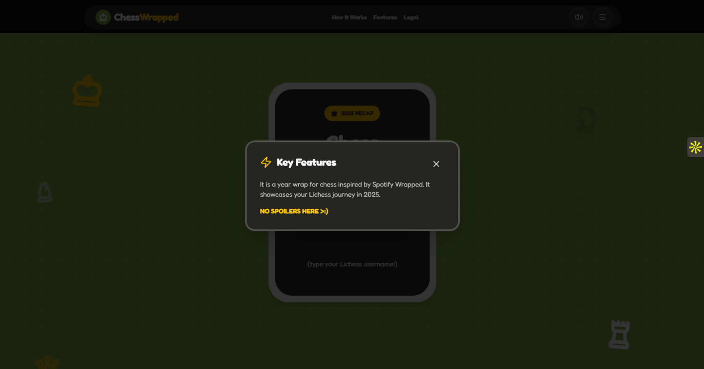

# ChessWrapped 2025
https://chesswrap.vercel.app/

**A "Spotify Wrapped" style experience for Lichess.org users, built with Next.js and the Lichess Public API.**






## 🛠️ Tech Stack

- **Framework:** Next.js
- **Language:** TypeScript
- **Styling:** Tailwind CSS
- **Animations:** Framer Motion
- **Data Source:** [Lichess.org Public API](https://lichess.org/api)
- **Icons:** Lucide React

## ⚙️ Architecture & Data Flow

1. **User Input:** The user enters their username on the landing page (`app/page.tsx`).
2. **Validation:** The app pings the Lichess API to verify the user exists and has archives for 2025.
3. **Data Fetching:**
    - On success, the user is routed to `/wrapped/[username]`.
    - The app fetches games using the Lichess API (NDJSON stream / archives).
    - Games are parsed to calculate Total Games, Win/Loss/Draw ratios, and specific Opening names.
4. **Visualization:**
    - Data is passed into the `<Carousel />` component.
    - Framer Motion handles the slide transitions and entrance animations.
    - Global Audio is managed in `layout.tsx` to persist across route changes.

---

## Getting Started

First, run the development server:

```bash
npm run dev
# or
yarn dev
# or
pnpm dev
# or
bun dev
```
Open [http://localhost:3000](http://localhost:3000) with your browser to see the result.

You can start editing the page by modifying `app/page.tsx`. The page auto-updates as you edit the file.

This project uses [`next/font`](https://nextjs.org/docs/app/building-your-application/optimizing/fonts) to automatically optimize and load [Geist](https://vercel.com/font), a new font family for Vercel.

## Inspiration

Inspired by:
chesswrap.me (Chess.com Wrapped)

## Support
If you liked it:

⭐ Star the repo

[☕ Buy me a coffee](https://buymeacoffee.com/athult)

[♟️ Challenge me to a game](https://lichess.org/@/SmackMyKnight)
